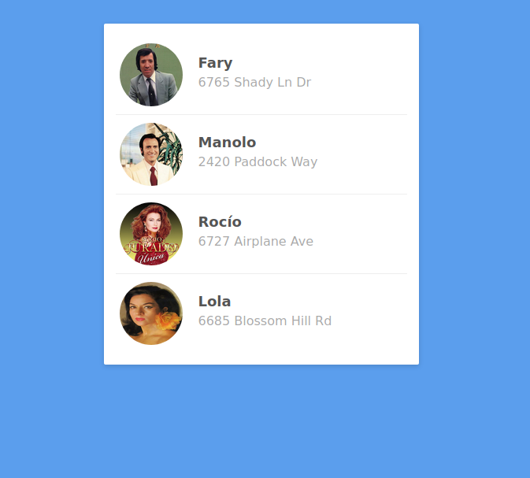

# :crossed_swords: Contactos copleros #

## Introducción ##

Dadas las imágenes en la carpeta `assets` tendrás que replicar el listado de contactos arriba mostrado.

Para acceder a los assets puedes utilizar `..` antes de la ruta relativa para ir hacia el directorio anterior. 

## Requisitos ##

- HTML

- CSS Flexbox

## Iteraciones ##

1. Crea el HTML, teniendo especial consideración en la semántica.

2. Agrega el CSS. Es obligado el uso de flexbox.

3. Escoge a tu artista favorito y hazle algunas transformaciones con efectos de transición.
