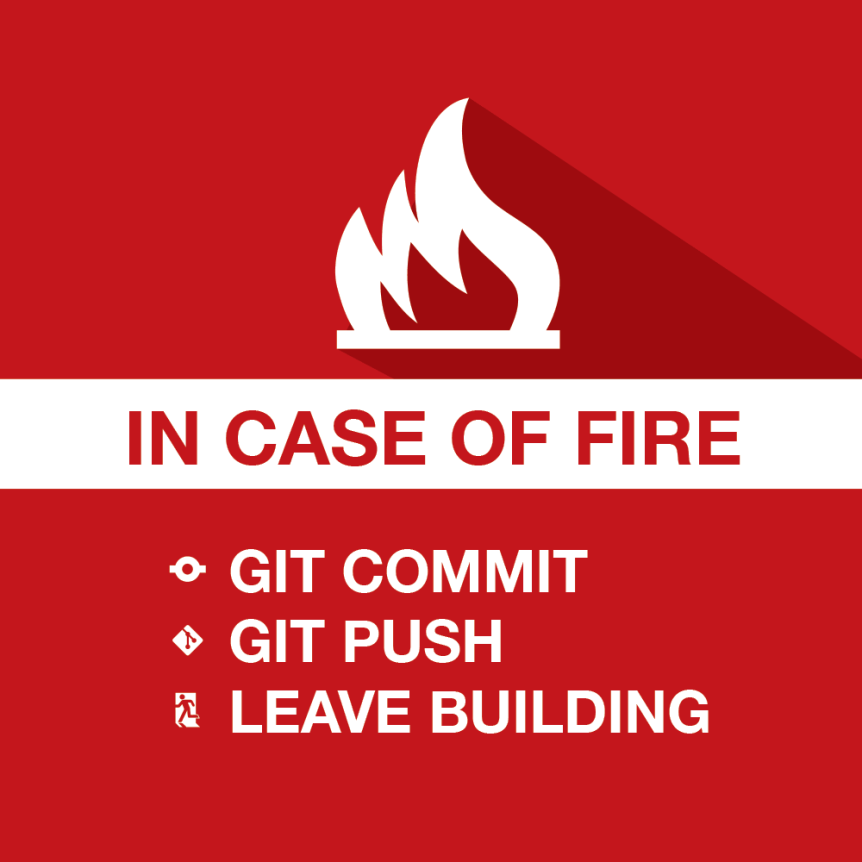

# [Bootcamp Web Developer Full Stack](https://www.thebridge.tech/bootcamps/bootcamp-fullstack-developer/)
### JS, ES6, Node.js, Frontend, Backend, Express, React, MERN, testing, DevOps

## Clase 17

### GitHub: Trabajar en equipo

## TALLER: `Git y GitHub` - Trabajar en equipo en un proyecto

 

 

Para ejercitar el uso de **`Git y GitHub`** en equipo el grupo deberá realizar un proyecto simple que consistirá en:

- Construir en `HTML` un formulario simple con los campos *usuario* y *contraseña* y un botón de envío. 

- Dar estilos con `CSS` a dicho formulario para que la interacción con él sea agradable y sencilla (tener en cuenta accesibilidad y usabilidad).

- Validar con `JavaScript` el nombre de *usuario* y *contraseña*. Para ello se almacenará en el fichero un array de al menos 3 objetos con las propiedades *usuario* y *contraseña*. 

- Añadir una pequeña descripción del proyecto en el fichero `README.md`

 
 

### Flujo de trabajo con Git y GitHub

 

1. Un integrante del grupo deberá crear un repositorio en Github.

2. El mismo integrante añadirá como colaborador a su/s compañero/s.

3. Un integrante creará en la rama `main` la estructura base del proyecto. Esta estructura estará compuesta de al menos: un fichero HTML, un fichero CSS, un fichero JS, las carpetas que consideren necesarias para que el proyecto esté correctamente organizado. 

4. Dicho integrante hará el primer push con `la estructura base` al repositorio de GitHub.

5. Otro integrante clonará el proyecto y creará una nueva rama `develop` a partir de la rama `main`. A continuación hará push al repositorio de GitHub para incluir la rama `develop`. A partir de este momento todos los cambios serán integrados en esta rama y **no volveremos a tocar la rama `main`**. 

6. Todos los integrantes del equipo actualizarán su repositorio en `local` con los nuevos cambios en `remoto`. 

7. Una vez definidas las tareas que realizará cada integrante del equipo, deberán moverse a la rama `develop` y sacar una `nueva rama`. Las ramas deben tener **el nombre de la funcionalidad** en la que se está trabajando. 

8. Cada integrante trabajará en su rama y cuando termine una parte pusheará al repositorio compartido sus `commits`. (*recordar que los commits pueden hacerse en local las veces que sean necesarias y luego subir todos los cambios de una sola vez al repositorio remoto. También tener en cuenta que puede que algún integrante del equipo necesite al menos una parte del trabajo de otro. En ese caso puede que sea necesario hacer push antes de tener la tarea 100% terminada*).

9. Una vez subida a GitHub la rama, el mismo integrante realizará una `Pull Request` desde su rama hacia `develop` (recordar no tocar `main`).

10. Otro integrante *revisará el código del compañero y dejará comentarios* si los considera necesarios. Si en alguna **`PR`** surgen **conflictos**, deberán resolverlos juntos para estar seguros de que el código siga funcionando. Cuando esté todo listo y revisado, se mergearán las actualizaciones en `develop`.

11. Una vez integradas las actualizaciones en `develop` los integrantes deberán moverse a `develop` en su repositorio local y hacer un pull para actualizar los cambios.

12. Para poder seguir trabajando cada uno en su funcionalidad, deberán moverse nuevamente a su propia rama y actualizar dicho código con las actualizaciones de `develop`.

13. Cuando se termine el trabajo en una rama individual y se haya mergeado correctamente en `develop` se deberá borrar la rama individual tanto del repositorio local como del repositorio en GitHub. 

 

📌 [**Buscador de comandos de Git**](https://gitexplorer.com/) 📌

 

**Y recuerda...**

